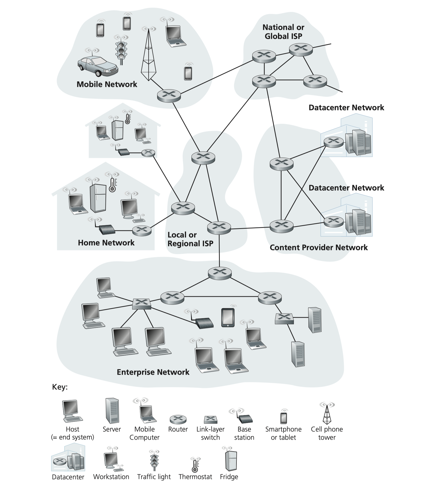
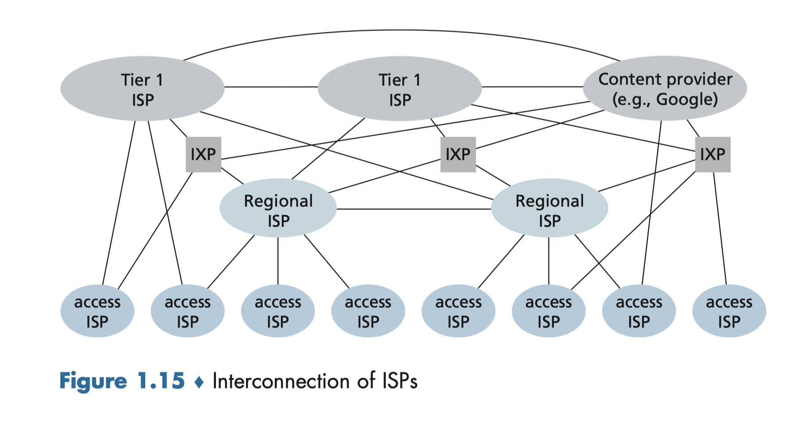
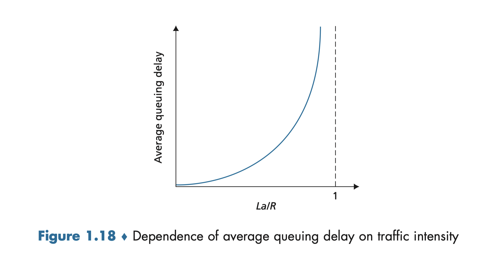
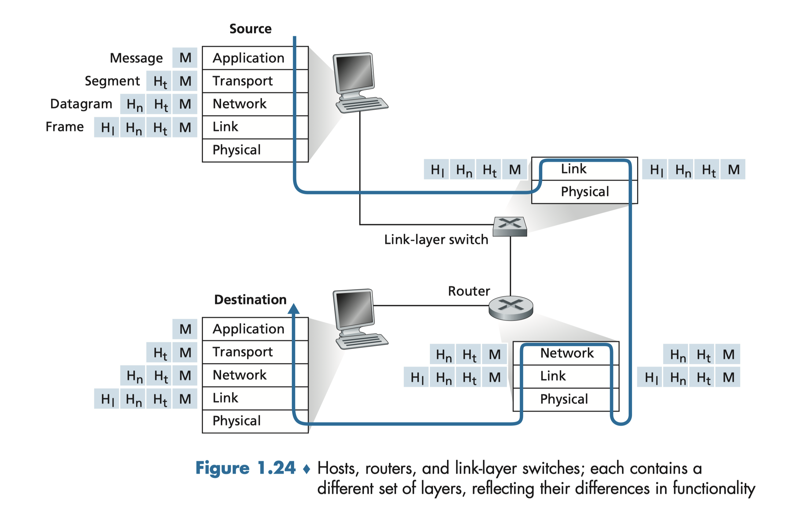

# Front Matter
Notes on computer networking.

## Schedule
| Week of  |                Monday                |           Wednesday           | Readings                      |  Assignments   |
| :------: | :----------------------------------: | :---------------------------: | :---------------------------- | :------------: |
| 01/02/23 |             **No Class**             |  [Introduction and Overview]  | 1.1, 1.3, 1.4                 |     A1 Out     |
| 01/09/23 |         [Protocol Layering]          |      [HTTP and the Web]       | 1.5                           |
| 01/16/23 |             **No Class**             |         [DNS and CDN]         | 2.2, 2.4                      |
| 01/23/23 | [Video Streaming and Cloud Systems]  |       [Transport Layer]       | 2.6, 3.1, 3.2, 3.3, 3.4       | A1 Due, A2 Out |
| 01/30/23 |             [TCP Basics]             | [Flow and Congestion Control] | 3.5, 3.6                      |
| 02/06/23 |      [More Congestion Control]       |    [Network Layer and IP]     | 3.7, 4.1, 4.3.1, 4.3.2, 4.3.5 |
| 02/13/23 |             [IP Routers]             |      [*Midterm Review*]       | 4.2                           |
| 02/20/23 |             **No Class**             |          **MIDTERM**          |                               |     A2 Due     |
| 02/27/23 |             **No Class**             |         **No Class**          |                               |     A3 Out     |
| 03/06/23 |        [Routing Fundamentals]        |      [Intra-AS Routing]       | 5.1, 5.2, 5.3                 |
| 03/13/23 | [IP Addressing and Inter-AS Routing] |             [BGP]             | 4.3.3, 5.4                    |
| 03/20/23 |    [Software-Defined Networking]     |         [Link Layer]          | 4.4, 5.5, 6.1, 6.3            | A3 Due, A4 Out |
| 03/27/23 |            [Switched LAN]            |         **No Class**          | 6.4                           |
| 04/03/23 |        [Wireless Networking]         |    [Datacenter Networking]    | 6.6, 7.1, 7.2, 7.3            |
| 04/10/23 |           [*Final Review*]           |         **No Class**          |
| 04/17/23 |             **No Class**             |                               |                               |     A4 Due     |
| 04/21/23 |              **FINAL**               |

## Motivating Questions
  * If I get to design the internet, what would I do?
  * What happens when I type an URL into a browser?
  * What happens when I search on Google?
  * How does p2p downloading work, and how do people get caught pirating with p2p?
  * How do I mess with the website of my high school?
  * How does TCP/IP work?
  * To what extent can my privacy be at risk on the internet? How?
  * How does VPN work?
  * How does the GFW work, and how to bypass it?
  * What does it take to build a social networking protocol?

## References
* [KR] *Computer Networking: A Top-Down Approach, 8th Edition*, Kurose and Ross, 2020.
* [PD] *Computer Networks: A Systems Approach, 6th Edition*, Peterson and Davie, 2021.

# Computer Networks and the internet

## What is the internet?

### Nuts n bolts definition
  * a computer network that interconnects billions of computing devices (**Hosts/end systems**) throughout the world.
  * End systems are connected together by a network of **communication links** and **packet switches**.
    * Communication links examples: copper wire, optical fiber, radio spectrum.
    * A packet switch takes packets from one of its communication links to another. Eg. routers (in the network core), link-layer switches(like wifi router and modem).
  * **Packet**: segment of data with header sent and reassembled.
  * End systems access the Internet through **Internet Service Providers (ISPs)**. Each ISP is in itself a network of packet switches and communication links.
    * Eg. local cable company, university ISPs
    * Eg. lower-tier ISPs are interconnected by upper-tier ISPs such as AT&T
  * End systems, packet switches, and other pieces of the Internet run **protocols** that decides how they talk to each other
    * Eg. **TCP/IP**

### Service definition
  * an infrastructure that provides services to applications running on end systems
    * eg. supports sending email, browsing web, streaming videos

## The network edge
  * Access networks: networks that connect end systems to the first router
    * mobile network: 5G phone -> cell tower -> ISP router
    * Enterprise network
    * Home network: TV -> modem -> ISP router
    * Datacenter network
    * Empowered by physical media
      * eg. cables, radio channels, fiber optics
  * The internet puts most of its complexity in its periphery

## The Network Core
  * Def. The mesh of packet switches and communication links that interconnects the access networks
  * Two ways of moving data through networks: packet switching and circuit switching
    * packet switching is simpler and has more transmission capacity.

### Packet Switching
  * Packet switches uses **store-and-forward transmission**
    * packet switches must receive the entire packet and process it before it forwards its first bit to the outbound link.
  * The packets are pipelined through the path because of store-and-forward
    * The delay of sending $P$ packets of $L$ bits each over a path of $N$ links each of rate $R$ is $d = (N+P-1)L/R$
  * Since it takes time to put packets onto the link, routers have **output buffers** that stores packets before they are sent out.
    * When the buffer is full, the **packet loss** occurs
  * Routers figures out where a packet should go via a **forwarding table**, which maps (portions of) the destination IP address to the router's outgoing link
    * The forwarding table is set automatically by **routing protocols**.

### A network of networks

## Delay, Loss, and Throughput

### Types of delay
* Processing delay: time to process the packet at the router
  * microseconds or less
* Queuing delay
  * microseconds to milliseconds
* Propagation delay: time for the packet to travel on the link
  * milliseconds in wide area networks
* Transmission delay
  * `# bits / transmission rate`
* **Total nodal delay** is the sum of the four above.
  * Its exact composition can vary significantly

### Queueing delay
* Depends on the rate at which packets arrive at the queue, the transmission rate of the link, and the nature of the traffic.
* Estimated by **traffic intensity**.
  * Suppose that the packets arrive at the queue at $a$ bits/sec, all packets consist of $L$ bits,
    and the transmission rate of the link is $R$ bits/sec.
    The traffic intensity is $aL/R$.
  * If $aL/R > 1$, the queue will grow without bound
* Typically, the arrivals to a queue do not follow any pattern.
  So, queueing delay grows exponentially with the traffic intensity.

### Throughput
* when there is no other intervening traffic, the throughput can simply be approximated as the minimum transmission rate along the path between source and destination.
* more generally the throughput depends not only on the transmission rates of the links along the path, but also on the intervening traffic.

## Protocol layers and their service models
* Network protocols are organized in layers.
* Each layer provides a service (**service model**) to the layer above it and uses the service of the layer below it.
* A protocol layer can be implemented in software or hardware or both.
* A layer n protocol distributed among the end systems, packet switches, and other components that make up the network.

### Internet protocol stack
|      ^      |
| :---------: |
| Application |
|  Transport  |
|   Network   |
|    Link     |
|  Physical   |
* **Application layer**: where network applications and their protocols reside
  * Eg. HTTP, FTP, DNS, SMTP
  * **Message**: application layer packet
* **Transport layer** transports messages between applications
  * Eg. TCP, UDP
  * **Segment**: transport layer packet
* **Network layer** routes segments between hosts
  * Eg. IP, routing protocols
  * **Datagram**: network layer packet
* **Link layer** delivers datagrams from one node (host or router) to another
  * Eg. Ethernet, WiFi
  * **Frame**: link layer packet
* **Physical layer** moves bits within the frame from one node to another
  * Eg. copper wire, optical fiber, radio spectrum

### Encapsulation

* Link-layer switches and routers
  * both only implement the bottom layers
  * Routers implement the network layer but link-layer switches do not
* At each layer, a packet has two types of fields: header fields and a **payload field**. The payload is typically a packet from the layer above.
